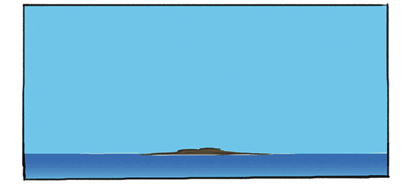
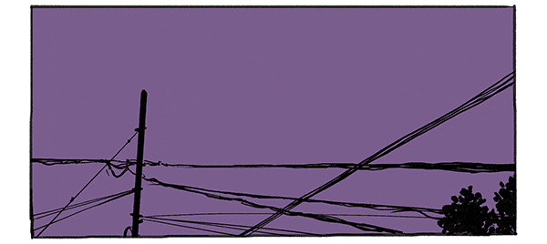

# 🌈 Clothes For You
<br>

 <p align="center"></p> 
<br>
<br>

## 배포 주소 
- <a href="https://clothes4oryou.netlify.app/" target="_blank" rel="noopener noreferrer">ClothesForYou</a>
<br>
<br>

## 💻 프로젝트 소개

**Clothes for You**는 OpenWeatherMap API를 이용하여 기온에 따른 옷차림을 추천해 주는 사이트입니다. 이 프로젝트는 출근할 때, 친구를 만날 때, 혹은 잠깐 외출할 때 어떻게 옷을 입고 나가야 할지에 대한 고민을 덜어주고 싶은 생각에서 시작되었습니다. 
<br>
<br>

## 😀 개발 인원

<br>

|                                                                 <p style="font-size:20px">이정현</p>                                                                  |
| :-------------------------------------------------------------------------------------------------------------------------------------------------------------------: |
| <p align="center"></p> |
|                                               <p style="font-size:18px"> [@zenghyun](https://github.com/zenghyun)  </p>                                               |

<br>
<br>

## 🕰 개발 기간

### - 23.02.13 ~ 23.03.08
 
  <br>
  <br>


## ⚙ 개발 환경

- `HTML`

- `CSS`

- `SCSS`

- `JAVASCRIPT`

- **IDE** : Visual Studio Code
- **library** : Chart.js

<br>
<br>

## 📃 페이지 소개
<br>

### 메인 페이지
메인 페이지에서는 위치에 따른 기온과 옷차림, 주간 날씨, [오늘 비와?](https://www.youtube.com/@user-vb8eg8qv1p)  YouTube 채널의 최근 일기 예보와 기온에 따른 옷차림 선정 Tip을 알려줍니다. 

<br>

### 서브 페이지
서브 페이지에서는 과거에 내가 입었던 옷차림을 업로드할 수 있는 다이어리와 **굳이 입어보지 않아도 옷에 대한 color match를 할 수 있는 기능이 있으면 좋겠다.** 라는 생각에 간단한 color match를 통해 나만의 코디를 완성해 볼 수 있게 만들었습니다. 

다이어리와 color match를 나란히 배치함으로써 다이어리에 올린 사진에서 입은 옷의 색을 `input` 요소의 `type="color"`를 통해 가져올 수 있게 하여 사용자가 실제로 갖고 있는 옷의 색을 반영하여 코디할 수 있는 장점이 있습니다. 

<br>
<br>

## 📷 페이지 사진
<br>

| 메인 페이지 - 날짜별 예보                                                                                                                                             | 메인 페이지 - 상세 날짜                                                                                                                                               |
| --------------------------------------------------------------------------------------------------------------------------------------------------------------------- | --------------------------------------------------------------------------------------------------------------------------------------------------------------------- |
| <p align="center"></p> | <p align="center"></p> |

<br>

| 메인 페이지 - 오늘의 코디                                                                                                                                             | 메인 페이지 - 주간 날씨                                                                                                                                               |
| --------------------------------------------------------------------------------------------------------------------------------------------------------------------- | --------------------------------------------------------------------------------------------------------------------------------------------------------------------- |
| <p align="center"></p> | <p align="center"></p> |

<br>

| 메인 페이지 - 날씨 예보                                                                                                                                               | 메인 페이지 - Choice Tip                                                                                                                                              |
| --------------------------------------------------------------------------------------------------------------------------------------------------------------------- | --------------------------------------------------------------------------------------------------------------------------------------------------------------------- |
| <p align="center"></p> | <p align="center"></p> |

<br>

| 서브 페이지 - Clothes Diary                                                                                                                                           | 서브 페이지 - Color Match                                                                                                                                             |
| --------------------------------------------------------------------------------------------------------------------------------------------------------------------- | --------------------------------------------------------------------------------------------------------------------------------------------------------------------- |
| <p align="center"></p> | <p align="center"></p> |


<br>
<br>

## 시작 가이드 
- OpenWeatherMap API를 사용하기 위한 API KEY가 필요합니다.  [OpenWeatherMap API](https://openweathermap.org/price) <br>

  ## **app.js** <br>

  ```javascript
    const API_KEY = ""; // 발급받은 API KEY를 넣어주세요.
  ```
  <br>
- YOUTUBE API를 사용하기 위한 API KEY가 필요합니다. [YouTube API](https://developers.google.com/youtube/v3/getting-started?hl=ko)
  ## **getYoutube.js** <br>
  ```javascript
  const YOUTUBE_API = ""; // 발급받은 API KEY를 넣어주세요.
  const YOUTUBE_CHANNEL = "UCs1omgoHHPENxs4b-fwMpPQ"; // "오늘 비와?" 채널의 고유 키입니다. 
  ```
<br>


## 저작권 
- [@ann_maulina](https://www.instagram.com/ann_maulina/?igshid=NTdlMDg3MTY%3D) 

<br>
  

| 오전 6시 ~ 오후 3시                                                                                                                                                   | 오후 4시 ~ 오후 7시                                                                                                                                                   | 오후 8시 ~ 아침 5시                                                                                                                                                   |
| --------------------------------------------------------------------------------------------------------------------------------------------------------------------- | --------------------------------------------------------------------------------------------------------------------------------------------------------------------- | --------------------------------------------------------------------------------------------------------------------------------------------------------------------- |
| <p align="center"></p> | <p align="center"></p> | <p align="center"></p> |

<br>

본 이미지의 저작권은 [@ann_maulina](https://www.instagram.com/ann_maulina/?igshid=NTdlMDg3MTY%3D)님에게 있습니다.

<br>


<br>

- [weather-icon](https://erikflowers.github.io/weather-icons/) ( 날씨 아이콘 저작권 )

<br>

- [flaticon](https://www.flaticon.com/kr/)  ( 의류 png 저작권 )

<br>
<br>

 ## 📌 주요 기능

- [OpenWeatherMap API에서 data를 불러오는 기능](#데이터-불러오기)

- [3시간 간격으로 5일간의 기온과 날씨를 알려주는 기능](#3시간-간격으로-5일간의-기온과-날씨-가져오기)

- [현재 시간을 기준으로 가까운 시간대의 기온과 상세 날씨, 체감온도, 습도, 풍향 및 풍속을 알려주는 기능](#현재-시간을-기준으로-가까운-시간대의-기온과-상세-날씨-체감온도-습도-풍향-및-풍속을-알려주기)

- [주간 날씨의 습도, 최고 기온, 최저 기온 및 날씨를 알려주는 기능](#주간-날씨의-습도-최고-기온-최저-기온-및-날씨를-알려주기)

- [평균 온도를 기준으로 기온별 옷차림을 정해주는 기능](#평균-온도를-기준으로-기온별-옷차림-알려주기)

- [유튜브 API를 이용하여 "오늘 비와?" 채널의 최근 날씨 예보를 보여주는 기능](#유튜브-api를-이용하여-오늘-비와-채널의-최근-날씨-예보-알려주기)

- [기온별 옷차림 선정 Tip을 알려주는 기능](#기온별-옷차림-선정-tip-알려주기)

- [내가 입었던 옷차림을 기록할 수 있는 기능](#내가-입었던-옷차림-기록하기)

- [옷을 입을 때 컬러 매치를 간단하게 도와줄 수 있는 기능](#옷-컬러-매치를-간단하게-알려주기)

<br>
<br>

## 🛠 확장성 

- [비가 왔을 때 우산이나 우비를 챙기라고 알려주는 기능](#비가-왔을-때-우산이나-우비-챙기는-알림-만들기)

 - [Clothes Diary](#clothes-diary-image-저장-방식)

 - [Color Match](#color-match의-활용성)

<br>
<br>

## 🛠 개선점

 - [✅ webpack의 필요성](#webpack의-필요성) 

 - [✅ gif 파일을 mp4로 대체하기](#gif-파일을-mp4로-대체하기)

 - [✅ 로딩화면 만들기](#로딩화면-만들기)

---

<br>

## 데이터 불러오기
<br>

### 📌 목차

- [1. OpenWeatherMap API에서 Data 받아오기](#1-openweathermap-api에서-data-받아오기)

- [2. 받아온 data를 통해 날씨 정보 불러오기](#2-받아온-data를-통해-날씨-정보-불러오기)


<br>

### **1.** OpenWeatherMap API에서 Data 받아오기

<br>


```javascript
(function getAPIData() {
  try {
    if (!sessionStorage.hasOwnProperty("location")) {
      navigator.geolocation.getCurrentPosition(onGeoOk, onGeoError);
    } else {
      const loadData = sessionStorage.getItem("location");
      const parsedData = JSON.parse(loadData);
      getWeather(parsedData);
    }
  } catch (error) {
    alert("위치를 가져올 수 없습니다.");
  }
})();
```

<br>

즉시 실행 함수를 이용하여 data를 받아오는 함수를 작성했습니다.<br>

이 함수는 세션 스토리지에 **location**이라는 이름으로 저장된 아이템이 있지 않을 때, `navigator.geolocation.getCurrentPosition(onGeoOk, onGeoError);`를 이용합니다.

만약, 세션 스토리지에 **location**이라는 이름으로 저장된 아이템이 있다면, 세션 스토리지에서 **location** 이름으로 저장된 JSON 포맷의 아이템을 객체로 변환하여 `getWeather` 함수의 매개변수로서 사용됩니다.
<br>
<br>
이는, 웹 페이지에 최초로 접속했을 때가 아닌 웹 페이지에서 다른 목차로 넘어갔다가 다시 메인(홈) 페이지로 돌아왔을 때, 다시 `fetch` 메서드를 통해 data를 받아오는 것이 아닌, 세션 스토리지에 저장된 data를 가져오기 위함입니다.
<br>
<br>

```javascript
async function onGeoOk(position) {
    const lat = position.coords.latitude;
    const lon = position.coords.longitude;

    const url = `https://api.openweathermap.org/data/2.5/forecast?lat=${lat}&lon=${lon}&appid=${API_KEY}&units=metric`;

    try {
        const response = await fetch(url);
        if (response.status >= 200 && response.status < 300) {
            const data = await response.json();
            const myData = JSON.stringify(data);
            sessionStorage.setItem('location', myData);
            getWeather(data);
        } else {
            const errData = await response.json();
            console.log(errData);
            throw new Error('Something went wrong - server side.');
        }
    } catch (error) {
        console.log(error);
        throw new Error('Something went wrong.');
    }
}
```

`onGekOk`를 통해 위도와 경도를 받아온 후, url을 통해 OpenweatherMapAPI에 data를 요청합니다.
 <br>

이때, 요청에 의한 응답 신호가 **200과 300사이**라면 제대로 된 응답이라고 판단하여, 데이터를 받아옵니다. 그 외의 응답 신호를 받는다면, `Something went wrong -server side.`라는 에러 메시지를 출력합니다. 만약 응답 신호를 받지 못했을 때는 `Something went wrong.`라는 메시지를 출력합니다. <br>

제대로 된 응답 신호를 통해 데이터를 받아왔다면, 그 데이터(객체)를 JSON 포맷의 문자열로 변환하여 세션 스토리지에 **location**이라는 이름으로 저장한 후, `getWeather` 함수를 호출합니다. <br>

만약 url을 매개변수로 사용하는 `fetch` 메서드가 제대로 된 동작을 하지 못한다면 `Data not found`라는 오류 메시지를 출력합니다.
<br>
<br>

### **2.** 받아온 data를 통해 날씨 정보 불러오기

`getWeather` 함수에서는 날씨 정보를 사용하는 방식이 크게 3가지가 있습니다. <br>

#### 1. 3시간 간격으로 5일간의 기온과 날씨를 알려주는 기능

#### 2. 현재 시간을 기준으로 가까운 시간대의 기온과 상세 날씨, 체감온도, 습도, 풍향 및 풍속을 알려주는 기능

#### 3. 주간 날씨의 습도, 최고 기온, 최저 기온 및 날씨를 알려주는 기능입니다.


<br>

다음은 `getWeather` 함수에서 가져온 날씨 data를 HTML에서 어떤 방식으로 보여줄 것인지에 대한 설명입니다.  

<br>

처음에는 받아온 데이터를 일일이 자식 요소로 HTML에 작성해 줬습니다. 그러다가 반복되는 요소를 통해 HTML의 길이가 길어지게 되었고, 코드의 길이를 줄이고 싶어졌습니다. <span style="color:red">**반복되는 요소를 하나의 틀로 만들어놓고, 안에 내용만 바꿔줄 수 있으면 좋지 않을까?**</span>라는 고민을 하다가 `template`요소와 `importNode`에 대해 알게 되었습니다. 

<br>

아래는 제가 사용한 방식입니다. 

### index.html
<br>

```html
<!-- 3시간 간격으로 5일간의 기온과 날씨 알려주는 template -->
<template id="weather-template">
  <li class="weather-item">
    <span class="weather-main"></span>
    <span class="temp"></span>
    <span class="day"></span>
  </li>
</template>

<!-- 현재 시간을 기준으로 가까운 시간대의 날씨 정보를 알려주는 template -->
<template id="sub-weather-template">
  <li class="weather-item">
    <span class="weather-main"></span>
    <span class="temp"></span>
    <span class="day"></span>
    <span class="time"></span>
   
    <span class="weather-data">
      <span class="weather-description"></span>
      <span class="feel-temp"></span>
      <span class="humidity"></span>
      <span class="wind"></span>
    </span>
  </li>
</template>

<!-- 주간 최고기온과 최저기온을 알려주는 template -->
<template id="weekly-weather-template">
  <li class="weather-item weekly-weather-item">
    <span class="today"></span>
    <span class="humidity"></span>
    <span class="max-weather-main"></span>
    <span class="max-temp"></span>
    <span class="min-weather-main"></span>
    <span class="min-temp"></span>
  </li>
</template>
```

`template` 요소를 사용한 이유는 반복되는 요소를 줄임으로서, 코드의 길이를 줄이기 위함입니다.

<br>

### getWeather
<br>


```javascript
function getWeather(data) {
    const weatherDatas = data.list.length;

    const weatherLists = document.getElementById('weather-lists');
    const subWeatherLists = document.getElementById('sub-weather-lists');
    const weeklyWeatherLists = document.getElementById('weekly-weather-lists');

    const weatherTemplate = document.getElementById('weather-template');
    const subWeatherTemplate = document.getElementById('sub-weather-template');
    const weeklyWeatherTemplate = document.getElementById('weekly-weather-template');

    /* 생략 */

for (let i = 0; i < weatherDatas; i++) {
        const weatherLi = document.importNode(weatherTemplate.content, true);
        const subWeatherLi = document.importNode(subWeatherTemplate.content, true);
        const weeklyWeatherLi = document.importNode(weeklyWeatherTemplate.content, true);

    /* 생략 */
```
[weatherLists](#1-3시간-간격으로-5일간의-기온과-날씨를-알려주는-기능), [subWeatherLists](#2-현재-시간을-기준으로-가까운-시간대의-기온과-상세-날씨-체감온도-습도-풍향-및-풍속을-알려주는-기능), [weeklyWeatherLists](#3-주간-날씨의-습도-최고-기온-최저-기온-및-날씨를-알려주는-기능입니다)는 HTML 상에서 template를 자식 요소로 받을 부모입니다. 

아래의 template 변수들은 HTML상에 있는 `template` 요소입니다. 

**for문**은 내가 받아온 ` const weatherDatas = data.list.length;`의 길이만큼 반복하게 됩니다. 각각의 `template`는 `importNode`를 통해 복제되며, **true**를 지정하여 자식 노드를 포함 시키겠다고 선언하였습니다. 

이를 통해 `template`을 이용하여 내가 원하는 부모 요소의 자식 요소로 날씨 data를 넣을 준비를 마쳤습니다. 

<br>
<br>
<br>

* * *

<br>

## 3시간 간격으로 5일간의 기온과 날씨 가져오기

<br>

### 📌 목차
- [1. 변수 선언 및 날짜별 예보 멘트 생성](#1-변수-선언-및-날짜별-예보-멘트-생성)
  
- [2. getMainWeather 함수 호출](#2-getmainweather-함수-호출)
  
- [3. getChart 함수 호출](#3-getchart-함수-호출)
<br>
<br>

### **1. 변수 선언 및 날짜별 예보 멘트 생성**
<br>
3시간 간격으로 5일간의 기온과 날씨를 알려주는 것을 <span style="color:red">main-weather</span>라고 지정하였습니다.
<br>

<br>
main-weather를 구하기 위해서는 아래와 같은 변수들이 필요합니다. 

<br>

```javascript
// 10 아래 달,월 0 설정 함수
function setUnderTenDate(date) {
  let returnDate;
  date < 10 ? (returnDate = `0${String(date)}`) : (returnDate = String(date));
  return returnDate;
}


  i = OpenWeatherMap API를 통해 가져온 data의 length만큼 for문을 반복할 때 값 

  nowDate = 실제 날짜를 가져온 값 ex: 3월 10일이면 10을 가져옴 

  weatherPeriod = 실제 날짜를 담기위한 배열 

  concreteDayData = 가져온 data가 갖고있는 날짜 ( utc 기준 )  ex: 2023-03-10 09:00:00

  calcData = 연도-월-일 양식의 실제 날짜를 가져온 값 ex: 2023-03-10

// 실제 한국 날짜 구하는 함수 
function calcDay(concreteDayData, includeMonth = null) {
  let date = concreteDayData.split(" ")[0];
  let concreteTime = parseInt(concreteDayData.split(" ")[1].slice(0, 2));
  let koreaDate = date.substr(0, date.length - 5);
  let setMonth = parseInt(date.substr(6, 1));
  let setDate = parseInt(date.substr(-2));

  if (concreteTime >= 15) {
    setDate += 1;
  }
  switch (setMonth) {
    case 1:
    case 3:
    case 5:
    case 7:
    case 8:
    case 10:
    case 12:
      if (setDate > 31) {
        setDate = 1;

        setMonth += 1;
      }
      break;
    case 4:
    case 6:
    case 9:
    case 11:
      if (setDate > 30) {
        setDate = 1;
        setMonth += 1;
      }
      break;
    case 2:
      if (setDate > 28) {
        setDate = 1;
        setMonth += 1;
      }
      break;
  }

  setDate = setUnderTenDate(setDate);
  setMonth = setUnderTenDate(setMonth);
  
  if (includeMonth) {
    includeMonth.push(setMonth);
    return [
      `${koreaDate}${includeMonth[0]}-`,
      `${koreaDate}${setMonth}-${setDate}`,
    ];
  } else {
    return [`${koreaDate}${setMonth}-`, `${koreaDate}${setMonth}-${setDate}`];
  }
}

temp = data에서 받아온 온도 

timeArr = Chart에 넣을 시간
```
<br>

다음은 `getWeather`함수에서 <span style="color:red">**main-weather**</span>를 구하는 방식입니다.
<br><br>

```javascript
// main-weather 
        if (i === 0) {
           weatherPeriod.push(setUnderTenDate(nowDate));
        }
        //  concreTime이 15시인 순간, 한국 시간은 다음날 0시 
        else if (i !== 0 && concreteTime === 15) {
            let calcData = calcDay(concreteDayData)[1];
            weatherPeriod.push(calcData);

            document.querySelector('.weather-period').textContent = `날짜별 예보 (${calcDay(concreteDayData, includeMonth)[0] + weatherPeriod[0]} ~ ${weatherPeriod[weatherPeriod.length - 1]})`;
        }


        const getMainWeatherData = { weatherLi, data, i, concreteDayData, temp, koreaTime, weatherLists };
        getMainWeather(getMainWeatherData);
```

첫 번째 날짜를 받기 위해 들어간 조건문에서 실제 날짜가 10일보다 작으면 0을 붙여주고 아니면 그대로 `weatherPeriod` 배열에 담기게 됩니다. 

i가 0이 아니고 `concreteTime`이 15시일 때는 한국 시간으로 오전 12시가 됐음을 의미하고 날짜가 바뀌게 되는 순간입니다. 

그 순간에 `calcData` 에는 calcDay함수를 통해 구해진 실제 날짜가 초기화되고 `weatherPeriod` 배열에 담기게 됩니다. 

그렇게 `weatherPeriod`에 담긴 값은 `weather-period`라는 class를 가진 요소에 <span style="color:skyblue">날짜별 예보 ( 예보를 시작한 날짜 ~ 예보가 끝나는 날짜 )</span>를 나타내게 됩니다.

<br>


### **2. getMainWeather 함수 호출**
<br>

**getMainWeatherData**를 매개변수로 `getMainWeather`함수를 호출 했습니다. 
<br><br>

```javascript
/**
 * 
 * @param {object} getMainWeatherData 
 * weatherLi: weather template 
 * data: weather API data 
 * i: data 개수 
 * concreteDayData: 데이터 별 날짜 
 * temp: 날짜 별 온도 
 * koreaTime: 한국 시간 
 * weatherLists: main-weather-lists 
 */
function getMainWeather(getMainWeatherData) {
    const { weatherLi, data, i, concreteDayData, temp, koreaTime, weatherLists } = getMainWeatherData;

    weatherLi.querySelector('.weather-main').insertAdjacentHTML('afterbegin', iconLoader(data, i, concreteDayData)[0]);

    weatherLi.querySelector('.temp').textContent = `${temp}˚`;

    weatherLi.querySelector('.day').textContent = getWeatherDay(i, concreteDayData, koreaTime);

    weatherLists.append(weatherLi);
}
```

`weather-main`이라는 클래스를 가진 요소에 `insertAdjacentHTML` 메서드를 사용하여 자식 요소로 **iconLoader** 함수를 호출한 return값의 첫 번째 값을 넣습니다.

<br>

### **iconLoader** 
<br>

```javascript
function iconLoader(data, i, concreteDayData) {
    const loadedMainWeather = `${data.list[i].weather[0].main}`;
    const weatherLoader = `${data.list[i].weather[0].description}`;
    return extractWeatherId(concreteDayData, loadedMainWeather, weatherLoader);
}
```

`iconLoader` 함수에서는 **OpenWeatherMap API**을 통해 받은 날씨 data에서 그날의 날씨와 상세 날씨 묘사를 변수에 초기화 시켜서 `extractWeatherId` 함수의 매게변수로서 사용됩니다.

즉, `iconLoader` 함수는 그날의 날씨와 상세 날씨 묘사를 받아오기 위한 함수입니다. 

<br>

### **extractWeatherId**
<br>

```javascript
function extractWeatherId(concreteDayData, loadedMainWeather, weatherLoader) {
    for (let i = 0; i < mainWeather.length; i++) {
        if (loadedMainWeather === mainWeather[i].title) {
            const loadedId = mainWeather[i].id;
            return getWeatherList(concreteDayData, weatherLoader, loadedId);
        }
    }
}
``` 

`extractWeatherId` 에서는 **app.js** 파일을 모듈화 시켜놓은 **weatherList.mjs** 파일에서 **import** 한 `mainWeather` 라는 이름으로 저장된 배열을 가져와서 사용합니다.

<br>


```javascript
import { subWeatherBackground } from '../common/function';
// app.js 파일 상단에 import
import { mainWeather, descriptionWeather } from './weatherList.mjs';
import { getClothes } from './clothes.mjs';
```
<br>

```javascript
// export 될 mainWeather
export const mainWeather = [
    {
        title: 'Thunderstorm',
        id: 100,
    },
    {
        title: "Drizzle",
        id: 101,
    },
    {
        title: "Rain",
        id: 102,
    },
    {
        title: "Snow",
        id: 103,
    },
    {
        title: "Atmosphere",
        id: 104,
    },
    {
        title: "Clear",
        id: 105,
    },
    {
        title: "Clouds",
        id: 106,
    },
];
```

`extractWeatherId` 에서 `mainWeather` 의 length 만큼 **for문**을 수행하면서, 그날의 날씨와 `mainWeather.title` 을 비교하여 같다면, `loadedId` 라는 변수에는 그에 해당되는 id 값을 초기화 시킵니다.

그리고 `getWeatherList`라는 함수의 매개변수로서 사용됩니다.

즉, `extractWeatherId` 함수는 그날의 날씨와 `mainWeather` 에 저장된 날씨가 같을 때, id를 가져오기 위한 함수입니다.  
<br>

### **getWeatherList**
<br>

```javascript
function getWeatherList(concreteDayData, weatherLoader, loadedId) {
    const weatherTime = parseInt(concreteDayData.split(' ')[1].slice(0, 2));
    for (let i = 0; i < descriptionWeather.length; i++) {
    if (loadedId === descriptionWeather[i].id) {
      const list = descriptionWeather[i].list;
      const j = list.indexOf(weatherLoader);
      if (j !== -1) {
        return getData(weatherTime, i, j);
      }
    }
  }
}
```
<br>

`getWeatherList` 함수에서는 **weatherList.mjs** 파일에서 **import** 한 `descriptionWeather`의 length만큼 **for문**을 수행하게 됩니다. 

<br>

```javascript
export const descriptionWeather = [
    {
        title: "Thunderstorm", // 날씨 
        id: 100, // mainWeather에서 가져온 id와 비교할 id
        list: [
            "thunderstorm with light rain", // 날씨 상세 묘사
            "wi-day-storm-showers", // 아침 ~ 낮 날씨 이모티콘
            "wi-storm-showers", // 낮 ~ 밤 날씨 이모티콘
            "wi-night-storm-showers", // 밤 ~ 아침 날씨 이모티콘
            "약한 비를 동반한 천둥", // 날씨 상세 묘사 멘트 

          // 생략
        ],
    },
    {
        title: "Drizzle",
        id: 101,
          list: [
            "light intensity drizzle",
            "wi-day-sprinkle",
            "wi-sprinkle",
            "wi-night-sleet",
            "약한 이슬비",
            
        // 생략
```
<br>

**for문**을 수행하면서 `loadedId`와 `descriptionWeather`의 id가 같다면, `descriptionWeather`의 list length만큼 **for문 (이중)** 을 수행합니다. 
<br>

그리고  **iconLoader** 함수에서 초기화 시킨 상세 날씨 묘사와 **descriptionWeather**의 list안에 상세 날씨 묘사가 같다면, **getData** 함수를 호출합니다. 
<br>

이때, **getData**의 매개변수에는 시간과 두번의 조건을 반복하면서 만족했을 때의 i와 j 값을 넘겨줍니다. i는 id가 같을 때의 위치를 담고 있고, j는 상세 날씨 묘사가 같을 때의 위치를 담고 있습니다. 

즉,  `getWeatherList` 함수는 내가 가져온 data의 상세 날씨 묘사를 저장된 날씨 묘사 배열과 비교하여 일치할 떄, 저장된 객체의 위치를 찾기 위한 함수입니다.  
<br>

### **getData**
<br>

```javascript
function getData(weatherTime, objectLength, listLength) {
    return [getIcon(weatherTime, objectLength, listLength), getDecsriptionWeather(objectLength, listLength)]
}
```
<br>

**getData** 함수에서는 가져온 매개변수를 다시 두 함수로 넘겨주게 됩니다. 

icon을 가져오기 위해 사용할 함수는 **getIcon** 이며, 후에 설명할 **subWeather**에 상세 날씨 묘사를 가져오기 위해 사용할 함수는 **getDescriptionWeather** 입니다. 

즉, **getData**은 **icon**을 가져오거나 **상세 날씨 묘사**를 가져올 때 지금까지의 route는 동일하기 때문에, 그 과정을 따로 분리하지 않았던 것을 분리해주기 위한 함수입니다. 

<br>

<p style="font-size:24px">weather icon을 가져오기 위한 과정</p>

iconLoader -> extractWeatherId -> getWeatherList -> getData -> getIcon

<br>

<p style="font-size:24px">날씨 상세 묘사를 가져오기 위한 과정</p>

iconLoader -> extractWeatherId -> getWeatherList -> getData -> getDescriptionWeather

<br>

### **getIcon**
<br>

```javascript
  // utc 시간 기준 9시간 더한게 현재 한국 시간 
    switch(true) {
         //  utc 기준 21시 ~ 6시 => 한국 기준 아침 6시 ~ 오후 3시 
        case (weatherTime >= 21 || weatherTime <= 6) : 
        return `<i class="wi ${descriptionWeather[objectLength].list[listLength + 1]}"></i>`;
        //  utc 기준 7시 ~ 13시 => 한국 기준 오후 4시 ~ 밤 10시 
        case (weatherTime >= 7 && weatherTime <= 13) :
        return `<i class="wi ${descriptionWeather[objectLength].list[listLength + 2]}"></i>`;
        //  utc 기준 14시 ~ 20시 => 한국 기준 밤 11시 ~ 오전 5시 
        case (weatherTime >= 14 && weatherTime <= 20) : 
        return `<i class="wi ${descriptionWeather[objectLength].list[listLength + 3]}"></i>`;
        default:  return;
    }
```
<br>
매개변수로 받은 weatherTime은 utc 기준이기 때문에 한국 기준으로 바꿔서 시간대에 맞는 icon을 가져오게 됩니다. 

<br>

```javascript
/**
 * 
 * @param {object} getMainWeatherData 
 * weatherLi: weather template 
 * data: weather API data 
 * i: data 개수 
 * concreteDayData: 데이터 별 날짜 
 * temp: 날짜 별 온도 
 * koreaTime: 한국 시간 
 * weatherLists: main-weather-lists 
 */
function getMainWeather(getMainWeatherData) {
    const { weatherLi, data, i, concreteDayData, temp, koreaTime, weatherLists } = getMainWeatherData;

    weatherLi.querySelector('.weather-main').insertAdjacentHTML('afterbegin', iconLoader(data, i, concreteDayData)[0]);

    weatherLi.querySelector('.temp').textContent = `${temp}˚`;

    weatherLi.querySelector('.day').textContent = getWeatherDay(i, concreteDayData, koreaTime);

    weatherLists.append(weatherLi);
}
```

`temp`라는 클래스를 가진 요소에 weather Data에서 가져온 온도를 `textContent`로 지정합니다.

`day`라는 클래스를 가진 요소에는 **getWeatherDay** 함수를 호출한 값을 `textContent`로 지정합니다. 

<br>

### **getWeatherDay**
<br>

```javascript
function getWeatherDay(i, concreteDayData, concreteTime) {
    if (i === 0) {
        return `\u00A0\u00A0\u00A0\u00A0\u00A0 오늘`;
    }
    if (concreteTime === 0) {
        return calcDay(concreteDayData)[1];
    }
}
```
<br>

첫번째로 받아온 data는 **"오늘"** 이라고 표시하고, 그 외에는 하루가 바뀔 때마다 실제 한국 날짜를 보여줍니다. 

마지막으로 **weatherLists**에 **weatherLi**를 `append` 해줘서 3시간 간격으로 5일동안의 날씨 icon과 온도 및 날짜를 알려줄 수 있게 됐습니다. 

<br>

### **3. getChart 함수 호출**
<br>

```javascript
// getWeather 함수 일부

    let tempArr = [];
    let timeArr = [];

 for (let i = 0; i < weatherDatas; i++) {

   let temp = Math.round(`${data.list[i].main.temp}`);

   tempArr.push(temp);

// getKoreaTime
function getKoreaTime(koreaTime) {

const KOREA_TIME_TYPE = {
    24 : 0,
    27 : 3,
    30 : 6,
    UNDEFINED: koreaTime,
};

return KOREA_TIME_TYPE[koreaTime] ?? KOREA_TIME_TYPE.UNDEFINED;
}

 // utc 시간 한국 표준 시간으로 변환
        const koreaTime = getKoreaTime(concreteTime+9);
        koreaTime >= 12 ? timeArr.push(`${koreaTime}:00 pm`) : timeArr.push(`0${koreaTime}:00 am`);

 }

  getChart(tempArr, timeArr);

```
<br>

`getChart` 함수를 호출시키기 전에 매개변수로 `tempArr`과 `timeArr`를 넘겨줍니다. `tempArr`는 전체 data의 온도를 담고있고, `timeArr`는 전체 data의 날짜를 담고 있습니다. 날짜는 **utc 시간이 기준인 data를 한국 시간으로 바꿔서 저장하였습니다.** 

<br>

### **getChart**
<br>

```javascript
function getChart(tempArr, timeArr) {

    const tempChart = document.getElementById("temp-chart").getContext("2d");
    let gradientStroke = tempChart.createLinearGradient(0, 50, 0, 0);
    gradientStroke.addColorStop(1, '#f11f61');
    gradientStroke.addColorStop(0, '#79a5fe');

    new Chart(tempChart, {
        scaleLineColor: "rgba(0,0,0,0)",
        type: 'line',
        data: {
            labels: timeArr,
            datasets: [
                {
                    data: tempArr,
                    label: ' ',
                    backgroundColor: "transparent",
                    fill: false,
                    lineTension: 0,
                    borderWidth: 4, // [막대 테두리 굵기 설정],
                    borderColor: gradientStroke,
                    pointBorderColor: gradientStroke,
                    pointBackgroundColor: gradientStroke,
                    pointHoverBackgroundColor: gradientStroke,
                    pointHoverBorderColor: gradientStroke,
                    pointBorderWidth: 4,
                    pointHoverRadius: 4,
                    pointHoverBorderWidth: 1,
                    pointRadius: 4,
                    pointStyle: 'rect', //포인터 스타일 변경
                }
            ]
        },
        options: {
            responsive: false, // 내 맘대로 크기 조정
            legend: {
                display: false,
            },
            scales: {
                yAxes: [{
                    ticks: {
                        fontColor: "transparent",
                    },
                    gridLines: {
                        color: 'transparent',
                        lineWidth: 0
                    }
                }],
                xAxes: [{
                    ticks: {
                        fontColor: 'black',
                        fontSize: 18,
                        fontFamily: 'Jua',
                    },
                    gridLines: {
                        color: "transparent",
                        lineWidth: 0
                    }
                }]
            }
        }
    });
}
```

이 함수는 **Chart.js** 라이브러리를 사용하여 선 그래프를 생성합니다. 함수는 두 개의 매개 변수 `tempArr`과 `timeArr`를 받습니다. 

<br>

캔버스 요소를 가져와서 2D 컨텍스트를 설정합니다.

<br>

```javascript
const tempChart = document.getElementById("temp-chart").getContext("2d");
```
<br>

gradientStroke라는 변수를 선언하고, 이는 `createLinearGradient()` 메서드를 사용하여 2D 컨텍스트에서 선형 그라데이션을 만듭니다.

<br>

```javascript
let gradientStroke = tempChart.createLinearGradient(0, 50, 0, 0);
gradientStroke.addColorStop(1, '#f11f61');
gradientStroke.addColorStop(0, '#79a5fe');
```
<br>

Chart 객체를 생성하고, options 객체와 함께 인수로 전달합니다.

<br>

```javascript
new Chart(tempChart, {
    ...
});
```
<br>
옵션 객체는 다음과 같습니다.

<br>

```javascript
options: {
    responsive: false,
    legend: {
        display: false,
    },
    scales: {
        yAxes: [{
            ticks: {
                fontColor: "transparent",
            },
            gridLines: {
                color: 'transparent',
                lineWidth: 0
            }
        }],
        xAxes: [{
            ticks: {
                fontColor: 'black',
                fontSize: 18,
                fontFamily: 'Jua',
            },
            gridLines: {
                color: "transparent",
                lineWidth: 0
            }
        }]
    }
}
```
그래프의 선 스타일, 축 레이블, 축 스타일 등을 정의합니다.

<br>

```javascript
scaleLineColor: "rgba(0,0,0,0)",
```

<br>

그래프 유형을 'line'으로 설정합니다.

<br>

```javascript
type: 'line',
```

<br>

데이터를 정의합니다. labels는 x축 레이블을 나타내며, datasets는 선 그래프의 데이터를 나타냅니다.

<br>

```javascript
data: {
    labels: timeArr,
    datasets: [
        {
            data: tempArr,
            label: ' ',
            backgroundColor: "transparent",
            fill: false,
            lineTension: 0,
            borderWidth: 4,
            borderColor: gradientStroke,
            pointBorderColor: gradientStroke,
            pointBackgroundColor: gradientStroke,
            pointHoverBackgroundColor: gradientStroke,
            pointHoverBorderColor: gradientStroke,
            pointBorderWidth: 4,
            pointHoverRadius: 4,
            pointHoverBorderWidth: 1,
            pointRadius: 4,
            pointStyle: 'rect',
        }
    ]
}
```

<br>

그래프의 크기 조정 및 범례 설정을 해줍니다.

<br>

```javascript
responsive: false,
legend: {
    display: false,
},
```
<br>

y축과 x축의 스타일을 정의합니다.

<br>

```javascript
scales: {
    yAxes: [{
        ticks: {
            fontColor: "transparent",
        },
        gridLines: {
            color: 'transparent',
            lineWidth: 0
        }
    }],
     xAxes: [{
                    ticks: {
                        fontColor: 'black',
                        fontSize: 18,
                        fontFamily: 'Jua',
                    },
                    gridLines: {
                        color: "transparent",
                        lineWidth: 0
                    }
                }]
            }
```
        
<br>

## 현재 시간을 기준으로 가까운 시간대의 기온과 상세 날씨, 체감온도, 습도, 풍향 및 풍속을 알려주기

<br>

### 📌 목차
- [1. subWeather data 가져오기](#getsubweatherdata)
  
- [2. subWeather Background Image 가져오기](#subweatherbackground)
  
<br>

### **getWeather**
<br>

```javascript
 let SubWeatherTrue = false;
 // 생략 

// sub-weather
const getSubWeatherData = { data, i, koreaTime, subWeatherLi, concreteDayData, humidity, subWeatherLists, nowHour };
       
        if (SubWeatherTrue === false) {
            SubWeatherTrue = true;

            getSubWeather(getSubWeatherData);
            subWeatherBackground(nowHour);
        }
```

`getSubWeather` 함수와 `subWeatherBackground` 함수를 호출하기 위해서는 `SubWeatherTrue`라는 변수가 **false**일 때만 동작하는 조건문을 성립해야 합니다. 

이 조건문은 처음에만 **false**를 만족시켜 조건문 내의 코드를 동작시키고 그 이후로는 더이상 조건을 만족시키지 못해 실행되지 않습니다.

<br>

### **getSubWeatherData**
<br>

```javascript
/**
 * 
 * @param {object} getSubWeatherData 
 *  data: weather API data 
 *  i: data 개수 
 *  koreaTime: 한국 시간 
 *  subWeatherLi: sub weather template 
 *  concreteDayData: 데이터 별 날짜 
 *  humidity: 습도 
 *  subWeatherLists: sub-weather-lists 
 *  nowHour: 현재 시간 
 */
function getSubWeather(getSubWeatherData) {
    const { data, i, koreaTime, subWeatherLi, concreteDayData, humidity, subWeatherLists, nowHour } = getSubWeatherData;
    let feelsLikeTemp = Math.round(`${data.list[i].main.feels_like}` * 10) / 10;
    let deg = `${data.list[i].wind.deg}`;
    let wind = `${data.list[i].wind.speed}`;
    let subTemp = Math.round(`${data.list[i].main.temp}` * 10) / 10;
    let getKoreaTime = koreaTime;
    getKoreaTime >= 12 ? getKoreaTime = `오후 ${getKoreaTime}시 기준` : getKoreaTime = `오전 ${getKoreaTime}시 기준`;

    subWeatherLi.querySelector('.time').textContent = getKoreaTime;

    subWeatherLi.querySelector('.weather-main').insertAdjacentHTML('afterbegin', iconLoader(data, i, concreteDayData)[0]);

    subWeatherLi.querySelector('.temp').textContent = `${subTemp}˚`;

    subWeatherLi.querySelector('.weather-description').textContent = iconLoader(data, i, concreteDayData)[1];

    subWeatherLi.querySelector('.feel-temp').textContent = `체감 온도 ${feelsLikeTemp}˚`;

    subWeatherLi.querySelector('.humidity').textContent = `습도 ${humidity}%`;

    let direction;

  switch (true) {
    case deg >= 0 && deg < 89:
      direction = "북동풍";
      break;
    case deg >= 90 && deg < 179:
      direction = "남동풍";
      break;
    case deg >= 180 && deg < 269:
      direction = "남서풍";
      break;
    default:
      direction = "북서풍";
  }

    subWeatherLi.querySelector('.wind').textContent = `${direction} ${wind}m/s`;

    const subWeatherData = {
        time: getKoreaTime,
        weatherIcon: iconLoader(data, i, concreteDayData)[0],
        subTemp,
        weatherDescription: iconLoader(data, i, concreteDayData)[1],
        feelTemp: feelsLikeTemp,
        humidity,
        direction,
        wind,
        nowHour,
    };
    let mySubWeatherData = JSON.stringify(subWeatherData);
    sessionStorage.setItem('subWeather', mySubWeatherData);
    subWeatherLists.append(subWeatherLi);
}
```
체감온도, 풍향, 풍속, subTemp를 구해줍니다.<br>

시간의 경우 한국 시간, 그리고 12시를 기준으로 오전 오후를 나눠서 설정해줍니다. 

`time`이라는 클래스명을 가진 요소에 시간을 넣어줍니다. 

`weather-main`이라는 클래스명을 가진 요소에 날씨 icon을 넣어줍니다. 

`temp`라는 클래스명을 가진 요소에 subTemp를 넣어줍니다. 

`weather-description`이라는 클래스명을 가진 요소에 날씨 상세 묘사를 넣어줍니다.

`feel-temp`라는 클래스명을 가진 요소에 체감 온도를 넣어줍니다.

`humidity`라는 클래스명을 가진 요소에 습도를 넣어줍니다. 

풍향은 0 ~ 360을 기준으로 90도씩 나눠서 풍향을 정해줍니다. 

`wind`라는 클래스명을 가진 요소에 풍향과 풍속을 넣어줍니다. 

`subWeatherData`의 경우 메인 페이지를 벗어나 서브 페이지로 이동했을 때, 같은 정보를 `fetch` 메서드로 호출하지 않고 세션 스토리지에 data를 저장하고 그 data를 이용하기 위해 사용할 변수입니다.

<br>

### **subWeatherBackground**
<br>

```javascript
function subWeatherBackground(nowHour) {
    const subWeatherArea = document.querySelector('.sub-weather');

    if (nowHour > 6 && nowHour < 17) {
        subWeatherArea.style.backgroundImage = "url('저장된 파일 경로')";
        subWeatherArea.style.color = "#333032";
    }
    else if (nowHour >= 17 && nowHour <= 20) {
        subWeatherArea.style.backgroundImage = "url('저장된 파일 경로')";
        subWeatherArea.style.color = "#aeeaff";
    } else {
        subWeatherArea.style.backgroundImage = "url('저장된 파일 경로')";
        subWeatherArea.style.color = "#eeeb99";
    }
}
```

`subWeatherBackground` 함수는 **nowHour**에 맞춰서 backgroundImage를 설정해주기 위한 함수입니다. 

시간에 따라 아침, 오후, 밤으로 나눠서 3가지의 배경으로 표현합니다. 
<br>
<br><br>

## 주간 날씨의 습도, 최고 기온, 최저 기온 및 날씨를 알려주기

<br>

### 📌 목차
- [1. 필요한 변수 선언 및 getWeeklyWeather 호출](#getweeklyweatherdata)
  
- [2. 요일 가져오기](#getday)
  

<br>

### **getWeather**
<br>

```javascript
  // weekly weather
  let changeDate = new Date(calcDay(concreteDayData)[1]);
  let getWeekOfDay = changeDate.getDay();
  let maxTemp = `${data.list[i].main.temp_max}`;
  let minTemp = `${data.list[i].main.temp_min}`;
  let humidity = `${data.list[i].main.humidity}`;

  //  weeklyMaxTemp, weeklyMinTemp, weekend, weeklyMaxIcon, weeklyMinIcon 차례대로 월,화,수,목,금,토,일
  let weeklyMaxTemp = [[], [], [], [], [], [], []];
  let weeklyMinTemp = [[], [], [], [], [], [], []];
  let weekend = [0, 0, 0, 0, 0, 0, 0];
  let weeklyMaxIcon = [[], [], [], [], [], [], []];
  let weeklyMinIcon = [[], [], [], [], [], [], []];
  let dailyMaxTempAry = [];
  let dailyMinTempAry = [];
  let getToday = [];
  let includeMonth = []; 

  // 생략 

  const getWeeklyWeatherData = { getWeekOfDay, weeklyWeatherLi, humidity, maxTemp, minTemp, data, i, concreteDayData, weeklyMaxTemp, weeklyMinTemp, weekend, weeklyWeatherLists, concreteTime, weeklyMaxIcon, weeklyMinIcon, dailyMaxTempAry, dailyMinTempAry, getToday };

  getWeeklyWeather(getWeeklyWeatherData);
```

### **getWeeklyWeatherData**
<br>

```javascript
/**
 * 
 * @param {object} getWeeklyWeatherData 
 * getWeekOfDay: 요일 구하기 위한 숫자 
 * weeklyWeatherLi: weekly weather template 
 * humidity: 습도 
 * maxTemp: 최고 기온 
 * minTemp: 최저 기온 
 * data: weather API data
 * i: data 개수 
 * concreteDayData: 데이터 별 날짜 
 * weeklyMaxTemp: 주간별 최고 기온 
 * weeklyMinTemp: 주간별 최저 기온 
 * weekend: 월, 화, 수, 목, 금, 토, 일 
 * weeklyWeatherLists: weekly-weather-lists 
 * concreteTime: utc 기준 12시 = 한국 시간 21시 마지막 출력 
 *weeklyMaxIcon: 시간대별 최고 기온 icon ary 
 * weeklyMinIcon: 시간대별 최저 기온 icon ary
 * dailyMaxTempAry: 요일별 최고 기온을 담는 배열 
 * dailyMinTempAry: 요일별 최저 기온을 담는 배열 
 * getToday: 요일을 저장하기 위한 배열 
 */
function getWeeklyWeather(getWeeklyWeatherData) {
    const { getWeekOfDay, weeklyWeatherLi, humidity, maxTemp, minTemp, data, i, concreteDayData, weeklyMaxTemp, weeklyMinTemp, weekend, weeklyWeatherLists, concreteTime, weeklyMaxIcon, weeklyMinIcon, dailyMaxTempAry, dailyMinTempAry, getToday } = getWeeklyWeatherData;
    const ONE_WEEK = 7;
    const LAST_CLOCK = 12; // utc 기준 12시는 한국 기준 21시 
    let dailyMaxTemp = [];
    let dailyMinTemp = [];
    let getMaxTempAry = [];
    let getMinTempAry = [];
    let getMaxTempIcon;
    let getMinTempIcon;

    getToday.push(getWeekOfDay);
   for (let j = 0; j < ONE_WEEK; j++) {
        if (getWeekOfDay === j) {
            weeklyMaxTemp[j][weekend[j]] = maxTemp;
            weeklyMinTemp[j][weekend[j]] = minTemp;
            weeklyMaxIcon[j][weekend[j]] = [maxTemp, iconLoader(data, i, concreteDayData)[0]];
            
            getMaxTempAry = weeklyMaxIcon[j].reduce((pre, cur) => [...pre, ...cur]);
            
            weeklyMinIcon[j][weekend[j]] = [minTemp, iconLoader(data, i, concreteDayData)[0]];
            
            getMinTempAry = weeklyMinIcon[j].reduce((pre, cur) => [...pre, ...cur]);
            
            weekend[j]++;
            dailyMaxTemp = Math.max(...weeklyMaxTemp[j]);
            dailyMinTemp = Math.min(...weeklyMinTemp[j]);
            getMaxTempIcon = getMaxTempAry.indexOf(String(dailyMaxTemp)) + 1;
            getMinTempIcon = getMinTempAry.indexOf(String(dailyMinTemp)) + 1;
        }
    }

    if (concreteTime === LAST_CLOCK || i === data.list.length - 1) {

        weeklyWeatherLi.querySelector('.max-weather-main').insertAdjacentHTML('afterbegin', getMaxTempAry[getMaxTempIcon]);

        weeklyWeatherLi.querySelector('.min-weather-main').insertAdjacentHTML('afterbegin', getMinTempAry[getMinTempIcon]);

        weeklyWeatherLi.querySelector('.max-temp').textContent = `${Math.round(dailyMaxTemp * 10) / 10}˚`;
        weeklyWeatherLi.querySelector('.min-temp').textContent = `${Math.round(dailyMinTemp * 10) / 10}˚`;

        weeklyWeatherLi.querySelector('.today').textContent = getDay(getWeekOfDay);
        weeklyWeatherLi.querySelector('.humidity').insertAdjacentHTML('afterend', `<i class="wi wi-raindrop humidity"> <span class= "pnt">${humidity}%</span></i>`);

        weeklyWeatherLists.append(weeklyWeatherLi);

        let eliminateDuplicateAry = [...new Set(getToday)];

        const getClothesAry = { dailyMaxTempAry, dailyMinTempAry, ONE_WEEK, dailyMaxTemp: (Math.round(dailyMaxTemp * 10) / 10), dailyMinTemp: (Math.round(dailyMinTemp * 10) / 10), eliminateDuplicateAry };
        clothesLoader(getClothesAry);
    }
}
```
<br>

위의 함수에서는 일주일을 기준으로 반복문을 사용합니다. 

주간 최고 기온을 구하기 위해 **weeklyMaxTemp**라는 이중 배열에 **weekend** 배열을 이용하여 **maxTemp**의 값을 담아줍니다. 

마찬가지로 주간 최저 기온을 구하기 위해 **weeklyMinTemp**라는 이중 배열에 **weekend** 배열을 이용하여 **minTemp**의 값을 담아줍니다. 

시간대별 최고 기온 icon을 구하기 위해 **WeeklyMaxIcon**라는 이중 배열에 **weekend** 배열을 이용하여 **maxTemp**와 그때의 날씨 icon을 담아줍니다. 

그 후에 `getMaxTempAry`라는 변수에 **weeklyMaxIcon** 배열을 `reduce` 메서드를 이용하여 1차원 배열로 바꿔서 저장해줍니다. 

마찬가지로 시간대별 최저 기온 icon을 구하기 위해 **WeeklyMinIcon**라는 이중 배열에 **weekend** 배열을 이용하여 **minTemp**와 그 때의 날씨 icon을 담아줍니다.

그 후에 `getMinTempAry`라는 변수에 **weeklyMinIcon** 배열을 `reduce` 메서드를 이용하여 1차원 배열로 바꿔서 저장해줍니다. 

**dailyMaxTemp**와 **dailyMinTemp** 변수는 최고 기온과 최저 기온을 구하기 위한 변수입니다. 구해진 기온은 각각 **getMaxTempIcon**과 **getMinTempIcon** 변수에서 icon의 위치를 구하기 위해 사용됩니다. 

**WeeklyMaxIcon**과 **WeeklyMinIcon**을 이중 배열로 최고, 최저 기온과 그때의 날씨 icon을 한번에 저장한 이유는 아래와 같습니다. 

최고 기온과 최저 기온의 값을 찾은 후, 그 값의 위치를 찾으면 그 다음 순서에는 그때의 날씨 icon이 들어있기 때문에 내가 찾은 기온에 맞는 날씨 icon을 가져올 수 있습니다. 
<br><br>

```javascript
 if (getWeeklyWeatherData[12] === LAST_CLOCK || getWeeklyWeatherData[6] === getWeeklyWeatherData[5].list.length - 1) {
  // 생략
```
<br>

위의 조건문에는 두가지 조건이 있습니다. 둘 중 하나라도 만족하면 조건문은 실행됩니다. 

**전자:** `LAST_CLOCK`은 utc기준 오후 12시를 의미합니다. 이는 utc 기준인 **concreTime**이 12시가 됐을 때, 한국 시간으로는 9시간을 더하여 다음 날이 된 것입니다. 
<br>

**후자:** 데이터의 반복된 횟수를 의미한 i가 전체 data의 마지막 순서가 됐을 때를 의미합니다. 

전자나 후자 중 하나라도 만족했을 때,  **weeklyWeatherLi** template에 값을 넣습니다. 

`max-weather-main`이라는 클래스명을 가진 요소에 최고 기온일 때 icon을 넣습니다. 

`min-weather-main`이라는 클래스명을 가진 요소에 최저 기온일 때 icon을 넣습니다. 

`max-temp`라는 클래스명을 가진 요소에 그날의 최고 기온을 넣습니다. 

`min-temp`라는 클래스명을 가진 요소에 그날의 최저 기온을 넣습니다. 

`today`라는 클래스명을 가진 요소에 `getDay` 함수를 호출한 값을 넣습니다. 

<br>

### **getDay**
```javascript
// 요일 구해주는 함수
function getDay(day) {
    const NumOfWeekend = [ "일요일", "월요일", "화요일", "수요일", "목요일", "금요일", "토요일",];
    return  NumOfWeekend[day];
}
```
<br>

`humidity`라는 클래스명을 가진 요소의 습도를 나타내는 icon과 그날의 습도를 넣어줍니다. 

마지막으로 **weeklyWeatherLists**에 **weeklyWeatherLi**를 `append` 해줌으로 주간 날씨의 습도, 최고 기온, 최저 기온 및 날씨를 알려줄 수 있게 됩니다. 

<br><br>

## 평균 온도를 기준으로 기온별 옷차림 알려주기 

<br>

### 📌 목차
- [1. 요일별 멘트 설정 및 평균 기온 산출](#clothesloader)
  
- [2. 기온에 맞는 옷차림 가져오기](#getclothes)
  
- [3. 기온에 따른 옷차림 선정 방법](#getclothesbytemperature)
<br>

<br>

```javascript
// getWeeklyWeather
function getWeeklyWeather(getWeeklyWeatherData) {

    getToday.push(getWeekOfDay);
  
  //생략

    let eliminateDuplicateAry = [...new Set(getToday)];

    const getClothesAry = { dailyMaxTempAry, dailyMinTempAry, ONE_WEEK, dailyMaxTemp: (Math.round(dailyMaxTemp * 10) / 10), dailyMinTemp: (Math.round(dailyMinTemp * 10) / 10), eliminateDuplicateAry };
    clothesLoader(getClothesAry);
       }
}
     
```

`getToday`에 `getWeekOfDay`를 담아줍니다.  
**getWeekOfDay**는 요일을 구하기 위한 숫자입니다.

`eliminateDuplicateAry`를 통해 담긴 숫자를 `Set`을 통해 중복 값을 없애줍니다. 

<br>

### **clothesLoader**
<br>

```javascript
/**
 * 
 * @param {*} getClothesAry
 * dailyMaxTempAry: 요일별 최고 기온을 담는 배열 
 * dailyMinTempAry: 요일별 최저 기온을 담는 배열 
 * ONE_WEEK: 일주일 
 * dailyMaxTemp: 요일별 최고 기온 
 * dailyMinTemp: 요일별 최저 기온 
 * eliminateDuplicateAry: 요일이 담긴 배열 
*/
function clothesLoader(getClothesAry) {
    const { dailyMaxTempAry, dailyMinTempAry, ONE_WEEK, dailyMaxTemp, dailyMinTemp, eliminateDuplicateAry } = getClothesAry;

    let clone = [];
    let waitTempDay; // 산출되지 않은 요일
    clone = [...eliminateDuplicateAry];
    dailyMaxTempAry.push(dailyMaxTemp);
    dailyMinTempAry.push(dailyMinTemp);

    for (let i = 1; i < ONE_WEEK; i++) {

        if (dailyMaxTempAry[i - 1] !== undefined) {
            document.querySelector(`.clothes-temp-area${i}`).textContent = `${getDay(clone[i - 1])} 최고 기온은 ${dailyMaxTempAry[i - 1]}˚, 최저 기온은 ${dailyMinTempAry[i - 1]}˚ 입니다.`;
            document.querySelector(`.clothes-by-temperature${i}`).textContent = "오늘의 코디";
            document.querySelector(`.show-text${i}`).textContent = `※ 오늘의 코디는 최고 기온과 최저 기온의 평균을 기준으로 산출합니다. ( 평균 온도 ${Math.round((dailyMaxTempAry[i - 1] + dailyMinTempAry[i - 1]) / 2)}˚ ) `;

            waitTempDay = clone[i - 1];

            getClothes(i, dailyMaxTempAry, dailyMinTempAry);
        } else if (dailyMaxTempAry[i - 1] === undefined) {
            document.querySelector(`.clothes-by-temperature${i}`).textContent = `${getDay(waitTempDay + 1)} 기온을 산출중 입니다.`;
        }
    }
}
```

`clone`이라는 배열에 `eliminateDuplicateAry`를 새로 담아줍니다. 

그리고 `dailMaxTempAry`와 `dailyMinTempAry`에는 각각 요일별 최고 기온과 최저 기온을 배열에 넣어줍니다. 

반복문은 **전체 요일 - 1**만큼 반복하는데 그 이유는 슬라이드로 표시할 요일이 총 6개이기 때문입니다.  
반복하면서 조건의 성립 여부에 따라 다른 코드가 실행됩니다.

dailyMaxTempAry[i-1]이 **undefined**가 아니라면, 조건 내의 요소에는 위와 같은 문구들이 입력됩니다. 

그리고 `getClothes` 함수를 실행합니다. 

만약 dailyMaxTempAry[i-1]이 **undefined**이라면, 기온을 산출중이라는 멘트가 입력됩니다.  

가져온 첫 번째 데이터의 시간이 오전 12시라면, 마지막 데이터는 첫 번째 날짜의 5일 뒤 21시기 때문에, 6번째 슬라이드에는 들어갈 기온이 없는 상태입니다. 이때 온도가 undefined으로 나오고, 온도를 기반으로 옷차림을 가져오지 못하기 때문에 이를 방지하기 위함입니다. 

<br>

### **getClothes**

**getClothes**는 모듈화 시켜놓은 `clothes.mjs`에서 import하여 가져온 함수입니다. 

```javascript
import { getClothes } from './clothes.mjs';
```
<br>

```javascript
// clothes.mjs
import { clothesTemperature, clothesRoute } from './clothesLists.mjs';

function removeOuter(i) {
  if (window.innerWidth < 420) {
    document.querySelector(`.by-temperature-clothes-list${i}`).style.marginLeft = '-40px';
  }
  document.querySelector(`.by-temperature-outer${i}`).style.width = '0px';
}

export const getClothes = (i, maxTemp, minTemp) => {
  const TEMP_LENGTH = clothesTemperature.length;
  let avgTemp = Math.round((maxTemp[i - 1] + minTemp[i - 1]) / 2);
  let selectedTemperatureIndex = -1;

  for (let j = TEMP_LENGTH - 1; j >= TEMP_LENGTH - 8; j--) {
    if (avgTemp < clothesTemperature[j].temperature) {
      selectedTemperatureIndex = j;
      break;
    }
  }

  if (selectedTemperatureIndex !== -1) {
    getClothesByTemperature(selectedTemperatureIndex, i);

    if (selectedTemperatureIndex <= TEMP_LENGTH - 7) {
      removeOuter(i);
    }
  }
};

```

`clothes.mjs` 파일은 `clothesLists.mjs` 파일을 import 하고 있습니다. 

TEMP_LENGTH는 `clothesLists.mjs`에서 import 해온 clothesTemperature의 length 값으로 초기화 시켰습니다. 

이는 아래의 조건문에서 온도를 가져와 평균 온도와 비교하면서 **평균 온도보다 크다면, 조건문을 만족시켜 `getClothesByTemperature` 함수를 실행시키기 위함입니다.** 

또한, 평균 온도가 23도 이상이면, 외투를 추천해주지 않기 때문에 외투를 나타내는 요소의 width를 0px로 지정하여 나머지 아이템들을 중앙 배치 시켰습니다. 

즉, 기온에 따른 옷차림을 가져오는 방식은 그날의 최고 온도와 최저 온도의 평균을 기점으로, 온도별로 정해진 옷차림을 만족시킬 때까지 조건문을 반복하여 조건을 성립했을 때, 정해진 옷차림을 가져오는 것 입니다.


<br>

### **getClothesByTemperature**

<br>

다음은 기온이 정해졌을 때 옷차림을 가져오는 방식입니다.

<br>

```javascript
function getClothesByTemperature(num, i) {

    let closet = [
        {
            clothes: {
                outerRandom: Math.floor(Math.random() * clothesRoute[num].clothes.outer.length),
                topRandom: Math.floor(Math.random() * clothesRoute[num].clothes.top.length),
                pantsRandom: Math.floor(Math.random() * clothesRoute[num].clothes.pants.length),
                socksRandom: Math.floor(Math.random() * clothesRoute[num].clothes.socks.length),
                accRandom: Math.floor(Math.random() * clothesRoute[num].clothes.acc.length),
            },
        }
    ];

    // get clothes
    document.querySelector(`.by-temperature-outer${i}`).style.backgroundImage = `${clothesRoute[num].clothes.outer[closet[0].clothes.outerRandom]}`;
    document.querySelector(`.by-temperature-top${i}`).style.backgroundImage = `${clothesRoute[num].clothes.top[closet[0].clothes.topRandom]}`;
    document.querySelector(`.by-temperature-pants${i}`).style.backgroundImage = `${clothesRoute[num].clothes.pants[closet[0].clothes.pantsRandom]}`;
    document.querySelector(`.by-temperature-socks${i}`).style.backgroundImage = `${clothesRoute[num].clothes.socks[closet[0].clothes.socksRandom]}`;
    document.querySelector(`.by-temperature-acc${i}`).style.backgroundImage = `${clothesRoute[num].clothes.acc[closet[0].clothes.accRandom]}`;

    // get clothes tags
    document.querySelector(`.by-temperature-outer-tag${i}`).textContent = `${clothesRoute[num].clothesName.outer[closet[0].clothes.outerRandom]}`;
    document.querySelector(`.by-temperature-top-tag${i}`).textContent = `${clothesRoute[num].clothesName.top[closet[0].clothes.topRandom]}`;
    document.querySelector(`.by-temperature-pants-tag${i}`).textContent = `${clothesRoute[num].clothesName.pants[closet[0].clothes.pantsRandom]}`;
    document.querySelector(`.by-temperature-socks-tag${i}`).textContent = `${clothesRoute[num].clothesName.socks[closet[0].clothes.socksRandom]}`;
    document.querySelector(`.by-temperature-acc-tag${i}`).textContent = `${clothesRoute[num].clothesName.acc[closet[0].clothes.accRandom]}`;
}
```
`closet` 배열안에 `clothes` 객체에는 종류별 random 값을 갖고 있습니다. 

<br>

### **clothesRoute**

<br>

```javascript
// clothesLists.mjs 

export const clothesRoute = [
    {
        temperature:28,
        clothes:{
            outer:[
                ""
            ],
            top: [
                "url('./images/clothes/28~/top/민소매.png')",
                "url('./images/clothes/28~/top/반팔 셔츠1.png')",
                "url('./images/clothes/28~/top/반팔 셔츠2.png')",
                "url('./images/clothes/28~/top/반팔 셔츠3.png')",
                "url('./images/clothes/28~/top/반팔 티1.png')",
                "url('./images/clothes/28~/top/반팔 티2.png')",
            ],
            // 생략 

            clothesName:{
            outer:[
                ""
            ],
            top: [
                "민소매",
                "반팔 셔츠",
                "반팔 셔츠",
                "반팔 셔츠",
                "반팔 티",
                "반팔 티",
            ], 
```
clothesRoute 안의 종류별로 옷차림을 정해놓고, 1부터 정해놓은 옷의 최대 수 만큼 무작위로 숫자를 생성합니다.

그리고 각각의 슬라이드에 무작위로 정해진 png 파일과 그에 맞는 이름을 가져와서 각각의 요소에 입력하게 됩니다. 

<br>

## 유튜브 API를 이용하여 "오늘 비와?" 채널의 최근 날씨 예보 알려주기 

<br>

### 📌 목차
- [1. 즉시 실행함수 호출](#즉시-실행함수-호출)
  
- [2. Youtube data 가져오기](#getyoutube)
  
<br>

<br>

### 즉시 실행함수 호출 

<br>

```javascript
/// getYoutube.js 

(function youtube() {

    const YOUTUBE_API = ""; // 발급받은 API KEY 넣기 
    const YOUTUBE_CHANNEL = "UCs1omgoHHPENxs4b-fwMpPQ";

    const url = `https://www.googleapis.com/youtube/v3/search?list=PLsU45F2D-sEanSDUJ0LUye7uK8A66zDiL&part=snippet&maxResults=1&channelId=${YOUTUBE_CHANNEL}&type=video&order=date&key=${YOUTUBE_API}`;
    
    fetch(url)
        .then(response => {
            if (response.status >= 200 && response.status < 300) {
                return response.json();
            } else {
                return response.json().then(errData => {
                    console.log(errData);
                    throw new Error('Something went wrong');
                });
            }
        })
        .catch(error => {
            console.log(error);
            throw new Error('Something went wrong.');
        })
        .then((data) => {
            getYoutube(data);
        })
})();

```

`getYoutube.js` 파일 안에 있는 `Youtube` 함수는 즉시실행 함수로, 웹 페이지가 load되면 즉시 실행됩니다. 

url 변수에 내가 발급받은 API KEY와 **오늘 비와?** 채널의 고유 KEY를 넣고 `fetch` 메서드를 사용하여 data를 받습니다.

import { subWeatherBackground } from '../common/function';
이는 `app.js`에서 **openWeatherMap API** API를 이용하여 data를 받아오는 방식과 동일합니다. 

data를 받아오는데 이상이 없다면 `getYoutube` 함수를 실행하게 됩니다. 

<br>

### getYoutube

<br>

```javascript
function getYoutube(data) {
    const videoLists = document.querySelector('.youtube-container');
    const videoTemplate = document.querySelector('.youtube-iframe-template');
    const weatheriframe = document.importNode(videoTemplate.content, true);
    const videoId = data.items[0].id.videoId

    let link = data.items[0].snippet.thumbnails.high.url;
    weatheriframe.querySelector('.youtube-link').setAttribute('href', `https://www.youtube.com/watch?v=${videoId}`);
    weatheriframe.querySelector('.thumbnail').style.backgroundImage = `url(${link})`;
    weatheriframe.querySelector('.thumbnail-title').insertAdjacentHTML('afterbegin', `${data.items[0].
    snippet.title}`);

    videoLists.append(weatheriframe);
}
```

### index.js 

```html
 <template class="youtube-iframe-template">
      <a class="youtube-link" href="" target="_blank" rel="noopener noreferrer">
        <div class="thumbnail"></div>
        <p class="thumbnail-title"></p>
      </a>
    </template>
```

<br>

import { subWeatherBackground } from '../common/function';
받아온 data를 웹 페이지에서 나타내는 방식은 `app.js`에서 template을 사용한 방식과 같습니다. 

data에서 **videoId**를 추출하여 `youtube-link`라는 클래스명을 가진 요소에 `setAttribute` 메서드로 href 경로를 지정해줍니다. 

그리고 data에서 thumbnail을 추출하여 `thumbnail`이라는 클래스명을 가진 요소의 backgroundImage에 경로를 지정해줍니다. 

마지막으로 `thumbnail-title`이라는 클래스명을 가진 요소에 data에서 추출한 영상의 title을 넣어줍니다. 


<br>

## 기온별 옷차림 선정 Tip 알려주기 

<br>

### choiceTip.js 

<br>

```javascript
const container = document.querySelector(".container");
const prev = document.querySelector(".prev");
const next = document.querySelector(".next");

(function addEvent() {
  prev.addEventListener('click', translateContainer.bind(this, 1));
  next.addEventListener('click', translateContainer.bind(this, -1));
})();

function translateContainer(direction) {
  const selectedBtn = (direction === 1) ? 'prev' : 'next';
  container.style.transitionDuration = '500ms';
  container.style.transform = `translateX(${direction * (100 / 5)}%)`;
  container.ontransitionend = () => reorganizeEl(selectedBtn);
}

function reorganizeEl(selectedBtn) {
  container.removeAttribute('style');
  (selectedBtn === 'prev') ? container.insertBefore(container.lastElementChild, container.firstElementChild) : container.appendChild(container.firstElementChild);
}
```
<br>

위 코드는 웹 페이지에서 슬라이드 쇼를 구현하는 코드입니다. 

HTML에서 클래스가 `container`인 요소와 `prev`, `next` 버튼을 찾아서 가져옵니다. 

그 후 즉시 실행함수를 통해 이전 및 다음 버튼에 클릭 이벤트 리스너를 추가합니다. 

클릭 이벤트가 발생하면 `translateContainer` 함수가 호출되며, 이 함수는 방향 인수를 받아서 container 요소를 해당 방향으로 이동시킵니다. 

`translateContainer` 함수에서는 방향 인수에 따라 이전 버튼 또는 다음 버튼을 선택하고, container 요소를 이동시키기 위해 `transitionDuration` 및 `transform` 스타일 속성을 설정합니다. 

이동이 완료되면 `container.ontransitionend` 이벤트 리스너가 호출됩니다. 이벤트 리스너에서는 `reorganizeEl` 함수가 호출되어 container 요소의 순서를 조정합니다.

`reorganizeEl` 함수는 선택한 버튼에 따라 container 요소의 순서를 변경합니다. `prev` 버튼이 클릭된 경우 마지막 요소가 첫 번째 요소의 앞에 추가됩니다. 또는, `next` 버튼이 클릭된  경우 첫 번째 요소가 container의 마지막 요소의 뒤에 추가됩니다. 

마지막으로, `reorganizeEl` 함수는 container 요소의 모든 스타일 속성을 제거하여 이전 스타일이 유지되지 않도록 합니다. 

<br>

## 내가 입었던 옷차림 기록하기 

<br>

### 📌 목차
- [1. 이미지 가져오기](#이미지-가져오기)

- [2. 이미지 등록하기](#이미지-등록하기)

- [3. 이미지 저장하기](#이미지-저장하기)

- [4. 이미지 삭제하기](#이미지-삭제하기)

<br>
<br>


## **uploadImage.js**


<br>

### 이미지 가져오기 
<br>

```javascript
// load Image 
(function loadImage() {

  const loadImage = localStorage.getItem(IMG_KEY);
  try {
    if (localStorage.hasOwnProperty(IMG_KEY)) {
      const parseImage = JSON.parse(loadImage);
      images = parseImage;

      parseImage.length === 0 ? fileName.value = `파일을 등록해주세요.` : fileName.value = `${parseImage.length}개의 파일이 등록되어 있습니다.`;
      
      parseImage.forEach(paintImage);
    }
  } catch (error) {
    console.log("Unable to fetch items from local storage.");
  }

})();
```
<br>

즉시 실행함수를 통해 이미지를 로드하는 함수를 실행합니다. 

`loadImage` 변수에 로컬 스토리지에 **IMG_KEY**라는 이름으로 저장된 data를 초기화 시킵니다. 

만약 로컬 스토리지에 **IMG_KEY** 라는 이름으로 저장된 data가 있다면 
`loadImage`를 객체로 변환하여 `parseImage` 변수에 초기화 시킵니다. 

그리고 전역 변수로 선언된 `images`에 초기화 시킵니다.

load된 data가 있다면 파일의 개수를 가져와서 `fileName`의 value에 개수를 지정해줍니다. 

파일이 있을 때와 없을 때의 value 값은 달라지게 위와 같이 달라지게 됩니다.

만약 이 작업을 수행하지 못하면 error가 발생하는데 이때 발생하는 error는 로컬 스토리지에 **IMG_KEY** 라는 이름으로 저장된 데이터가 없을 때 발생하는 것이 아닌, data를 가져오는 행위 자체를 어떤 이유로 하지 못할 때 발생합니다. 

**IMG_KEY** 라는 이름으로 저장된 데이터를 가져왔다면, 그 수만큼 `paintImage` 함수를 반복하게 됩니다. 

<br>

```javascript
// paint Image 
function paintImage(newImageObj) {
  const imgPreview = document.querySelector('.img-preview');

  const uploadContainer = document.createElement('div');
  uploadContainer.classList.add("upload-container");
  uploadContainer.id = newImageObj.id;

  const log = document.createElement('div');
  log.classList.add('log');
  log.textContent = newImageObj.log;

  const img = document.createElement('img');
  img.setAttribute('src', newImageObj.src);

  const btn = document.createElement('span');
  btn.textContent = "X";
  btn.addEventListener('click', deleteImage)

  uploadContainer.appendChild(btn);
  uploadContainer.appendChild(log);
  uploadContainer.appendChild(img);
  imgPreview.appendChild(uploadContainer);
}
```

등록된 파일의 수만큼 `paintImage` 함수를 반복합니다. 

이 함수는 `newImageObj`라는 매개변수를 받아들입니다. 

먼저, 함수 내부에서 `img-preview`라는 클래스명을 가진 요소를 찾아 변수 `imgPreview`에 할당합니다. 

그 후, `uploadContainer`라는 새로운 div 요소를 생성하고 `uploadContainer`에 `upload-container`라는 클래스명을 추가하며, `newImageObj` 객체의 id 속성을 `uploadContainer`의 id 속성으로 설정합니다.

다음으로, `log`라는 새로운 div 요소를 생성하고 `log`에 `log`라는 클래스명을 추가하며, `newImageObj` 객체의 `log` 속성 값을 `log` 요소의 텍스트 내용으로 설정합니다.

그 다음 `img` 라는 새로운 img 요소를 생성하고, **src** 속성 값을 `newImageObj` 객체의 **src** 속성으로 설정합니다.

그 후에 `btn`이라는 새로운 span 요소를 생성하고 **X** 라는 텍스트 내용을 추가합니다. `btn` 요소에 **"click"** 이벤트 핸들러를 추가하여 `deleteImage` 함수를 호출하도록 설정합니다. 

마지막으로 `uploadContainer`에 `btn`, `log`, `img` 요소를 추가하고, `imgPreview`에 `uploadContainer`를 추가하여 새로운 이미지 요소를 HTML 페이지에 렌더링 합니다. 

<br>

### 이미지 등록하기

<br>

```javascript
const getFileBtn = document.querySelector('#image');
const fileName = document.querySelector('#fileName-preview');
let routeLength = 0;

getFileBtn.addEventListener('change', (event) => {
  let route = event.target.files
  const routeAry = (Array.from(route));
  routeLength += route.length;

    fileName.value = (`${routeLength}개의 파일이 등록되었습니다.`).trim();
  handleImg(routeAry);
})
```
<br>

위 코드는 파일 업로드 기능을 구현하는 코드입니다.

`image`라는 id를 갖는 요소를 가져와서 `getFileBtn`이라는 변수에 할당시킵니다. 

이 요소는 사용자가 파일을 업로드 할 수 있는 버튼입니다. 

그리고 `fileName-preview`라는 id를 갖는 요소를 가져와서 `fileName`이라는 변수에 할당시킵니다. 


`getFileBtn`에 **change** 이벤트 핸들러를 추가합니다. 이벤트가 발생하면, 업로드된 파일 정보를 `route` 변수에 할당합니다. 

`route` 변수는 FileList 객체를 가지므로, 배열로 변환하여 `routeAry` 변수에 할당합니다. 

`routeLength` 변수에는 현재까지 업로드된 파일의 개수를 누적합니다. 

`fileName` 요소의 값을 업로드된 파일 개수를 표시하는 문자열로 설정합니다. 

마지막으로, `handleImg` 함수를 호출하여 업로드된 이미지 파일들을 처리합니다. 

<br>

### 이미지 저장하기  

```javascript
// upload한 image 
function handleImg(routeAry) {
  routeAry.forEach((data) => {
    if (data.type.includes('image')) {
      // 파일 제한을 둬서 이미지만 골라서 출력 
      const fileReader = new FileReader();
      fileReader.readAsDataURL(data);

      fileReader.addEventListener('load', (event) => {

        let date = new Date();
        let today = date.toLocaleDateString();
        const newImageObj = {
          id: Date.now(),
          log: today,
          src: event.target.result
        }
        images.push(newImageObj);
        paintImage(newImageObj);
        saveImage();
      })
    }
  })
}
```

위 함수는 업로드된 이미지 파일들을 처리하는 함수 `handleImg`를 정의하는 코드입니다.

`handleImg` 함수는 `routeAry`라는 매개변수를 받습니다. 
`routeAry`는 업로드된 파일들의 목록을 담은 배열입니다. 

`forEach` 메서드를 사용하여 배열의 모든 요소에 대해 반복 작업을 수행합니다. 

반복문 내에서 각 파일의 타입이 **image**인지 확인하고, 이미지 파일일 경우 `FileReader` 객체를 생성합니다. **FileReader`는 파일을 비동기적으로 읽는 객체로, **readAsDataURL** 메서드를 사용하여 해당 파일을 읽어들입니다. 

`load` 이벤트 리스너를 추가하여 파일 읽기 작업이 완료된 후에 실행될 콜백 함수를 정의합니다. `event.target.result`를 사용하여 파일의 데이터 URL을 가져옵니다. 

데이터 URL은 파일의 내용을 Base64로 인코딩한 문자열로, 이미지 파일을 화면에 출력할 수 있는 형식으로 변환합니다. 

그 다음, 새로운 이미지 객체를 생성합니다. 객체에는 고유한 ID, 현재 날짜, 데이터 URL 정보가 포함됩니다. 

`paintImage` 함수를 호출하여 새로운 이미지를 HTML 페이지에 출력합니다. 

마지막으로, `saveImage` 함수를 호출하여 `images` 배열에 저장된 이미지 정보를 로컬 스토리지에 저장합니다. 


### saveImage 

<br>

```javascript
// save Image 
function saveImage() {
  localStorage.setItem(IMG_KEY, JSON.stringify(images));
}
```


<br>

### 이미지 삭제하기 

<br>

```javascript

// 전체 제거 
const deleteAllBtn = document.querySelector('.delete-all');
deleteAllBtn.addEventListener('click', () => {
  localStorage.removeItem(IMG_KEY);
  const imgPreview = document.querySelector('.img-preview');
  imgPreview.replaceChildren();
  fileName.value = "";
});

// 이미지 개수 문구 업데이트
function updateImageCount() {
  const imgCount = images.length;
  fileName.value =
    imgCount > 0
      ? `${imgCount}개의 파일이 등록되었습니다.`
      : "파일을 등록해주세요.";
}

// delete image
function deleteImage(event) {

  // 내가 선택한 이미지 제거 
  const img = event.target.parentElement;
  img.remove();
  images = images.filter(image => image.id !== parseInt(img.id));
  saveImage();
  routeLength = images.length;
  updateImageCount();
}
```
<br>

`deleteAllBtn` 버튼을 클릭하면 `localStorage` 에서 **IMG_KEY**를 제거합니다. **IMG_KEY**는 이미지 정보를 저장하기 위해 사용되는 로컬 스토리지 키 입니다. 이후에 `imgPreview` 라는 HTML 요소를 가져와 `replaceChildren` 메서드를 사용하여 해당 요소의 모든 자식 요소를 제거합니다. 

`deleteImage` 함수는 `event` 객체를 매개변수로 받습니다. 

해당 객체는 클릭 이벤트에 대한 정보를 담고 있습니다. 클릭된 요소의 부모 요소인 `img` 요소를 가져오며, 이는 이미지가 출력된 HTML 요소입니다. 

`remove` 메서드를 사용하여 `img`요소를 제거하며, `images` 배열에서 해당 이미지의 ID와 일치하는 요소를 찾아 `filter` 메서드를 사용하여 배열에서 삭제합니다. 

그리고 fileName.value를 해당 file의 개수의 맞게 변경합니다.

마지막으로 `saveImage` 함수를 호출하여 업데이트 된 이미지 정보를 로컬 스토리지에 저장합니다. 

<br>


## 옷 컬러 매치를 간단하게 알려주기 

<br>

```javascript
const pickColor = document.querySelectorAll('.clothes-color');
const detailClothesBox = document.querySelectorAll('.detail-clothes-box');

pickColor.forEach(pick => {
  pick.addEventListener('input', (event) => {
    let changeColor = event.target.value;
    let changeClothesColor = event.currentTarget.previousElementSibling;
    changeClothesColor.style.color = changeColor;
  })
})
```

<br>

위 코드는 `pickColor`라는 클래스를 가진 여러 오소에 대한 이벤트 리스너를 등록합니다. 

각각의 `pickColor` 요소는 색상 선택을 위한 입력 필드를 나타냅니다.

`forEach` 메서드를 사용하여 모든 `pickColor` 요소에 대해 반복하며, 각 요소에 **input** 이벤트 리스너를 등록합니다.

**input** 이벤트가 발생하면, 이벤트 핸들러 함수가 실행됩니다. 
이 함수는 이벤트 객체를 매개변수로 받습니다.

`event.target` 속성을 사용하여 발생한 이벤트를 처리하는 요소를 가져옵니다. 여기서는 색상 선택 입력 필드를 나타내는 요소를 가져옵니다. 

그 후에 `event.currentTarget` 속성을 사용하여 이벤트를 등록한 요소를 가져옵니다. 여기서는 `pick` 변수를 통해 현재 선택된 색상 입력 필드 요소를 가져옵니다. 

`previousElementSibling` 속성을 사용하여 선택된 색상 입력 필드 요소의 이전 형제 요소를 가져옵니다. 

이전 형제 요소는 색상 선택 입력 필드 이전에 위치한 `detailClothesBox` 요소입니다. 

그 후에 `style.color` 속성을 사용하여 `changeClothesColor` 변수에서 가져온 요소의 글자 색을 선택된 색상으로 변경합니다. 

이를 통해 선택한 색상에 따라 해당 옷의 색상을 변경할 수 있습니다.

<br>
<br>

***

<br>

## **🛠️확장성**


<br>

### **비가 왔을 때 우산이나 우비 챙기는 알림 만들기** 

<br>

주간 날씨를 알려줄 때 최고 기온이나 최저 기온에 비가 오는 예보가 있으면, 우산이나 우비를 챙기라는 간단한 알림이 있으면 좋을 것 같습니다. 

주간 날씨가 아니더라도 비 예보가 잡혀있다면, 우산이나 우비를 챙기라는 이벤트를 발생시켜 사용자에게 알려주는 기능을 추가해 볼 예정입니다.

<br>

### **Clothes Diary Image 저장 방식**

<br>

Clothes Diary 에서는 업로드한 image를 로컬 스토리지에 저장하고 있습니다. 

로컬 스토리지의 최대 용량은 브라우저와 운영체제의 종류에 따라 다릅니다. 

하지만, 일반적으로 브라우저당 **5MB**의 저장 용량을 가집니다. 

따라서 로컬 스토리지에 image를 저장하는 방식은 적절하지 않습니다. 

로컬 스토리지에 image와 같은 용량이 큰 파일을 저장하기 보다는 DB를 사용하여 저장하는 방식이 더 적절합니다. 

현재 이 방식은 간단하게 **Clothes For You** 에는 내가 입은 옷을 기록할 수 있는 **Clothes Diary** 라는 기능을 구현해 놓은 것에 만족할 수 밖에 없는 수준입니다. 

만약 DB를 이용한다면, 사용자의 개인 정보를 받아 로그인과 회원가입을 해서 보다 최계화된 사이트를 이용할 수 있는 방식으로 확장할 수 있다는 개선 방안이 있습니다.

또한, 훨씬 더 많은 image도 저장할 수 있습니다. 

그래서 DB를 사용하는 방식으로 추후에 개선해볼 예정입니다.

<br>

### **Color Match의 활용성**

<br>

**Color Match**에서는 UI 측면으로 아쉬운 부분이 있습니다. 

머리 속으로 그려봤던 "이렇게 옷을 매치하거나, 이런 식으로 색 배치를 해서 입으면 어떨까?" 라는 생각을 자주 했던 제 생각에서 나온 이 기능은 아직 미흡한 점이 있습니다. 

첫 번째로 확실하게 기능의 의도를 파악하기 어렵습니다. 배치되어 있는 옷들은 **fontello**를 이용하여 png 파일을 `i` 태그의 요소로 바꾼 것 입니다. 

원하는 png 파일을 구하는 데 있어 어려움이 있던 것도 있지만, 직관적이지 못하고, 사용자에게 유용한 기능이라고 하기에는 부족한 것 같습니다. 

하지만, 기능적인 측면으로 봤을 때는 옷을 직접 매치해보지 않아도 되는 편리성과, 눈으로 볼 수 있는 시각성에 있어 뚜렷한 장점이 있기 때문에 좀 더 세련된 png 파일을 사용하면 더욱 직관적으로 바꿀 수 있습니다. 

두 번째로 `input` 요소의 `type=color`를 이용한 방식입니다. 색을 변경하는 데 있어 가장 먼저 든 방법이 `type=color`를 이용한 방법이라서 이를 사용했지만, 다소 아쉽다는 생각이 듭니다. 지금은 떠오르지 않지만, 사용자에게 더 좋은 방향으로 다가갈 수 있는 방법이 떠오르면 바꿀 예정입니다. 

<br>

----

<br>

## **🛠️ 개선점**

<br>

### **webpack의 필요성** 

일반적으로 특정 웹 사이트를 접근할 때 5초 이내로 웹 사이트가 표시되지 않으면 대부분의 사용자들은 해당 사이트를 벗어나거나 집중력을 잃게 됩니다. 

현재 이 프로젝트에서 로딩 속도를 늦추는 가장 큰 원인은 브라우저에서 서버로 요청하는 파일 숫자가 많다는 것 입니다. 로딩 속도를 줄이기 위해 webpack을 사용하여 파일들을 압축하고 병합하는 작업을 하면 좋을 것 같습니다. 

<br>

### [자세한 후기](https://despiteallthat.tistory.com/261)

<br>

```js
var path = require("path");
var webpack = require("webpack");
var HtmlWebpackPlugin = require("html-webpack-plugin");
var CopyWebpackPlugin = require("copy-webpack-plugin");

module.exports = {
  mode: "production",
  entry: {
    main: "./js/index/app.js",
    additional: [
      "./js/index/choiceTip.js",
      "./js/index/clothesSlider.js",
      "./js/index/getYoutube.js",
      "./js/index/scroll.js",
    ],
    myClothes: [
        "./js/myClothes/app.js",
        "./js/myClothes/colorSet.js",
        "./js/myClothes/scroll.js",
        "./js/myClothes/uploadImage.js",
      ],
  },
  output: {
    filename: "[name].bundle.js",
    path: path.resolve(__dirname, "dist"),
    clean: true,
  },
  module: {
    rules: [
      {
        test: /\.js$/,
        exclude: /(node_modules|pages)/,
        use: {
          loader: "babel-loader",
        },
      },
      {
        test: /\.css$/,
        use: [{ loader: "style-loader" }, { loader: "css-loader" }],
      },
      {
        test: /\.scss$/,
        use: [
          { loader: "style-loader" },
          { loader: "css-loader" },
          { loader: "sass-loader" },
        ],
      },
      {
        test: /\.(png|jpe?g|gif)$/,
        loader: "file-loader",
        options: {
          name: "[name].[ext]",
          outputPath: "./images",
        },
      },
    ],
  },
  plugins: [
    new HtmlWebpackPlugin({
      filename: "index.html",
      template: "./index.html", 
      excludeChunks: ["myClothes"], // myClothes.js를 index.html에 적용하지 않음
    }),
    new HtmlWebpackPlugin({
      filename: "views/myClothes.html",
      template: "./views/myClothes.html",
      chunks: ["myClothes"], // myClothes.js와 연결
    }),
    new CopyWebpackPlugin({
      patterns: [
        { from: "css", to: "css" },
        { from: "scss", to: "scss" },
        { from: "images", to: "images"},
        { from: "images", to: "images"},
        { from: "font", to: "font"},
      ],
    }),
  ],
};

```

<br>

### **gif 파일을 mp4로 대체하기**

<br>

```html
// 개선 전 
  
  
  

// 개선 후 

  <video autoplay loop muted playsinline>
    <source src="./images/weather/06시~15시.mp4" type="video/mp4" />
  </video>
  <video autoplay loop muted playsinline>
    <source src="./images/weather/16시~19시.mp4" type="video/mp4" />
  </video>
  <video autoplay loop muted playsinline>
    <source src="./images/weather/20시~05시.mp4" type="video/mp4" />
  </video>
```
Lighthouse를 사용하여 성능 검사시 gif 파일 사용으로 인한 2.5~3.1초 가량의 페이지 로딩 지연 현상이 발생하여 mp4로 대체하여 해결하였습니다. 

<br>


### **로딩화면 만들기** 

open weather API를 통해 data를 받아오고, 그에 맞는 옷차림을 가져오기까지의 로딩 시간이 길어져 사용자 대기 시간이 길어진다는 문제점을 발견하였습니다. 

로딩 시간을 줄이고자, 기존 함수의 로직들을 살펴보며 리팩토링 중에 있고, 

UI 적으로 날씨 정보를 받아오고 있음을 사용자에게 알려주는 modal 기능을 만들었습니다. 

data를 가져오기 전까지만 보여주며, 모든 준비가 되면 modal 창은 자동으로 종료됩니다. 

<br>

 <p align="center"></p> 